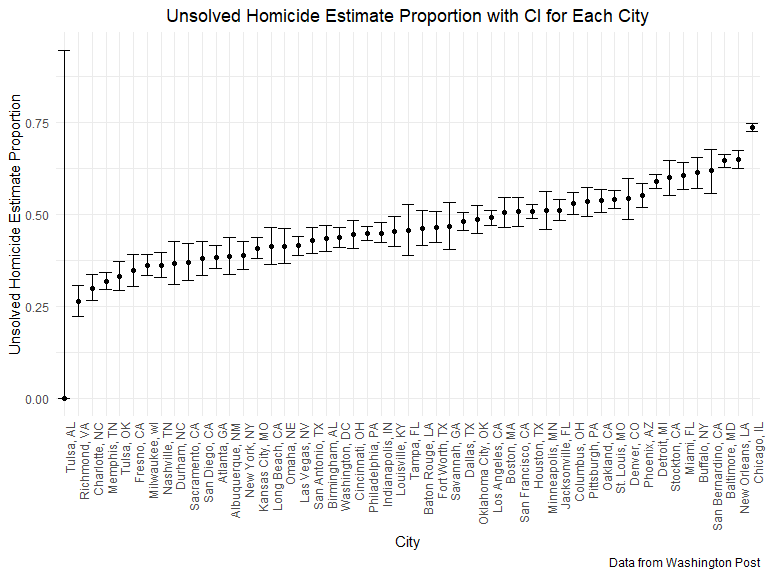
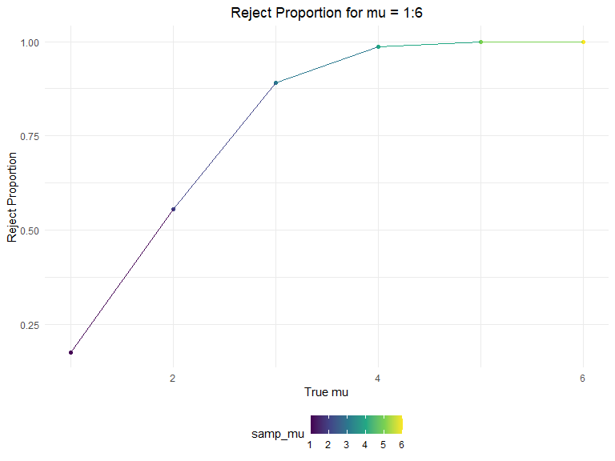
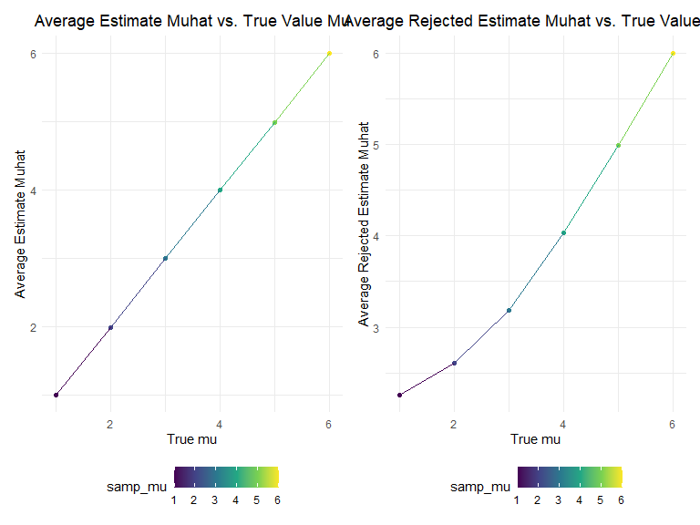

p8105_hw5_yy3307
================
2022-11-03

## Problem 1

The code chunk below imports the data in individual spreadsheets
contained in `./data`. To do this, I create a dataframe that includes
the list of all files in that directory and the complete path to each
file. As a next step, I `map` over paths and import data using the
`read_csv` function. Finally, I `unnest` the result of `map`.

``` r
full_df = 
  tibble(
    files = list.files("data/"),
    path = str_c("data/", files)
  ) %>% 
  mutate(data = map(path, read_csv)) %>% 
  unnest()
```

The result of the previous code chunk isn’t tidy – data are wide rather
than long, and some important variables are included as parts of others.
The code chunk below tides the data using string manipulations on the
file, converting from wide to long, and selecting relevant variables.

``` r
tidy_df = 
  full_df %>% 
  mutate(
    files = str_replace(files, ".csv", ""),
    group = str_sub(files, 1, 3)) %>% 
  pivot_longer(
    week_1:week_8,
    names_to = "week",
    values_to = "outcome",
    names_prefix = "week_") %>% 
  mutate(week = as.numeric(week)) %>% 
  select(group, subj = files, week, outcome)
```

Finally, the code chunk below creates a plot showing individual data,
faceted by group.

``` r
tidy_df %>% 
  ggplot(aes(x = week, y = outcome, group = subj, color = group)) + 
  geom_point() + 
  geom_path() + 
  facet_grid(~group)
```


This plot suggests high within-subject correlation – subjects who start
above average end up above average, and those that start below average
end up below average. Subjects in the control group generally don’t
change over time, but those in the experiment group increase their
outcome in a roughly linear way.

## Problem 2

First we need to import the `homicide` dataset and clean-up the variable
names.

``` r
homicide_raw = 
  read_csv("https://raw.githubusercontent.com/washingtonpost/data-homicides/master/homicide-data.csv") %>% 
  janitor::clean_names()
```

To describe raw data, we need some basic inline R code to generate some
info that we need.

``` r
raw_row = nrow(homicide_raw)
raw_col = ncol(homicide_raw)
```

The raw homicide dataset has 52179 rows and 12 columns, including main
variables of `reported_date`, victims’ information such as
`name, age, race, gender`, reported `city` and its corresponding
geographic location `lat, lon`, and cases’ `disposition`.

Then we want to analyze total number of homicides and unsolved homicides
in each city state. First we need to add a `city_state` variable as a
combination of the `city` and `state`. Then we can group the data by
`city_state` and count for number of total homicide and unsolved
homicide in each city state.

``` r
homicide_raw =
  homicide_raw %>% 
  mutate(
    city_state = str_c(city, ", ", state)
  )

homicide_count =
  homicide_raw %>%
  group_by(city_state) %>%
  summarize(
    total_homicide = n(),
    total_unsolved_homicide = sum(disposition == "Closed without arrest" | disposition == "Open/No arrest")
  )

homicide_count
```

    ## # A tibble: 51 × 3
    ##    city_state      total_homicide total_unsolved_homicide
    ##    <chr>                    <int>                   <int>
    ##  1 Albuquerque, NM            378                     146
    ##  2 Atlanta, GA                973                     373
    ##  3 Baltimore, MD             2827                    1825
    ##  4 Baton Rouge, LA            424                     196
    ##  5 Birmingham, AL             800                     347
    ##  6 Boston, MA                 614                     310
    ##  7 Buffalo, NY                521                     319
    ##  8 Charlotte, NC              687                     206
    ##  9 Chicago, IL               5535                    4073
    ## 10 Cincinnati, OH             694                     309
    ## # … with 41 more rows

What we want next is to use `prop.test` function to estimate the
proportion of unsolved homicides for `Baltimore, MD` and tidy it.

``` r
Baltimore_summary = 
  homicide_count %>% 
  filter(city_state == "Baltimore, MD")


Baltimore_homicide =
  prop.test(
    Baltimore_summary %>% pull(total_unsolved_homicide), 
    Baltimore_summary %>% pull(total_homicide)
  ) %>% 
  broom::tidy()
```

We get the `estimated proportion` of unsolved homicides in Baltimore, MD
is about 64.5560665%, with a confidence interval from (62.7562458%,
66.315986%).

The we are going to expand the estimation proportion of unsolved
homicides for all cities in the dataset. I’ll use `map2` function to
setup a nested tibble with the test statistics I wanted for each cities,
and then use the `map` function to apply `broom:tidy` function to all
tibbles. After `unnest` the tibbles, we can select the variables that we
want to keep.

``` r
cities_summary =
  homicide_count %>%
  mutate(
    cities_est = map2(.x = total_unsolved_homicide, .y = total_homicide, ~prop.test(.x, .y)),
    cities_est = map(.x = cities_est, ~broom::tidy(.x))
  ) %>% 
  unnest() %>%
  select(city_state, estimate, conf.low, conf.high)
```

We can use `fct_reorder` to reorganize cities according to the
proportion of unsolved homicides. Then, we need to make a plot
visualizing the estimations as `geom_point` and CI for each cities as
`geom_errorbar`.

``` r
city_plot =
  cities_summary %>%
  mutate(city_state = fct_reorder(city_state, estimate)) %>% 
  ggplot(aes(x = city_state, y = estimate)) +
  geom_point() +
  geom_errorbar(aes(ymin = conf.low, ymax = conf.high)) +
  labs(
    title = "Unsolved Homicide Estimate Proportion with CI for Each City",
    y = "Unsolved Homicide Estimate Proportion",
    x = "City",
    caption = "Data from Washington Post"
  ) +
  theme(axis.text.x = element_text(angle = 90, hjust = 1), plot.title = element_text(hjust = 0.5))

city_plot
```



## Problem 3

First we are going to set design elements with fixed n = 30 and fixed
sigma = 5. We can create a function of the following t-distribution
below.

``` r
sim_mean_p = function(n = 30, mu, sigma = 5) {
  
  sim_data = tibble(
    x = rnorm(n = n, mean = mu, sd = sigma),
  )
  
  sim_data %>% 
    t.test(mu = 0, alpha = 0.05, conf.level = 0.95) %>% 
    broom::tidy() %>%
    mutate(
      mu_hat = estimate,
      p_value = p.value
    ) %>% 
    select(mu_hat, p_value)
}
```

Then are are going to `rerun` the model function to generate 5000
datasets with mu = 0 and alpha = 0.05.

``` r
sim_results_df = 
  rerun(5000, sim_mean_p(mu = 0)) %>% 
  bind_rows()

sim_results_df
```

    ## # A tibble: 5,000 × 2
    ##     mu_hat p_value
    ##      <dbl>   <dbl>
    ##  1 -0.832    0.343
    ##  2 -0.0645   0.940
    ##  3 -0.226    0.821
    ##  4  0.158    0.875
    ##  5 -0.946    0.382
    ##  6 -0.631    0.510
    ##  7  1.28     0.155
    ##  8  0.720    0.382
    ##  9 -0.540    0.618
    ## 10  0.978    0.297
    ## # … with 4,990 more rows

We can also repeat the above with specific values of mu.

``` r
sim_mu = 
  expand.grid(
    samp_mu = 1:6,
    iteration = 1:5000
  ) %>% 
  mutate(
    estimate_mu = map(.x = samp_mu, ~sim_mean_p(mu = .x))
  ) %>%
  unnest(estimate_mu) %>% 
  select(samp_mu, mu_hat, p_value)
```

Then we need to summarize the result dataset and extract the reject
proportion.

``` r
reject_prop =
  sim_mu %>% 
  group_by(samp_mu) %>% 
  summarize(
    total_count = n(),
    reject_count = sum(p_value < 0.05),
    reject_proportion = reject_count / total_count
  ) %>% 
  bind_rows()
```

The first plot shows the proportion of times the null was rejected.

``` r
reject_prop %>% 
  ggplot(aes(x = samp_mu, y = reject_proportion, color = samp_mu)) +
  geom_point() +
  geom_line() +
  labs(
    title = "Reject Proportion for mu = 1:6",
    x = "True mu",
    y = "Reject Proportion"
  ) +
  theme(plot.title = element_text(hjust = 0.5))
```



From the reject proportion vs. true value of mu plot we can analyze an
increasing trend, which indicates as the true value of mu increases the
reject proportion will also increase. Also, we can see the slope of the
increasing trend is greatest from mu = 1:3, as the true value of mu keep
increasing the reject proportion gets to approximately 1.0 as maximum.
So we can tell that as the true value of mu increase, the power will
increase and eventually reach approximately 1.0.

Make a plot showing the average estimate of mu_hat on the y axis and the
true value of μ on the x axis.

``` r
mu_average =
  sim_mu %>% 
  group_by(samp_mu) %>% 
  summarize(
    muhat_average = mean(mu_hat)
  ) %>% 
  bind_rows() %>% 
  ggplot(aes(x = samp_mu, y = muhat_average, color = samp_mu)) +
  geom_point() +
  geom_line() +
  labs(
    title = "Average Estimate Muhat vs. True Value Mu",
    x = "True mu",
    y = "Average Estimate Muhat"
  ) +
  theme(plot.title = element_text(hjust = 0.5))
```

Make a second plot showing the average estimate of mu_hat only in
samples for which the null was rejected on the y axis and the true value
of μ on the x axis.

``` r
reject_mu_average =
  sim_mu %>%
  group_by(samp_mu) %>% 
  filter(p_value < 0.05) %>% 
  summarize(
    reject_muhat_average = mean(mu_hat)
  ) %>% 
  bind_rows() %>% 
  ggplot(aes(x = samp_mu, y = reject_muhat_average, color = samp_mu)) +
  geom_point() +
  geom_line() +
  labs(
    title = "Average Rejected Estimate Muhat vs. True Value Mu",
    x = "True mu",
    y = "Average Rejected Estimate Muhat"
  ) +
  theme(plot.title = element_text(hjust = 0.5))
```

We can display the two plots together for convenience to compare.

``` r
mu_average + reject_mu_average
```



From the `Average Rejected Estimate Muhat vs. True Value Mu` plot we can
see that the sample average of muhat across tests for which the null is
rejected is not exactly following the true value of mu, which is
slightly higher than the true mu. But as the true mu increasing, the
sample average of muhat across tests for which the null is rejected is
getting closer and closer to the true mu. I think the main reason is
that low effect size reduce the power of the study, and as the power
goes up we are more likely to reject the null, so that the sample
average of muhat across tests for which the null is rejected will
eventually approximately equals to true value of mu.
